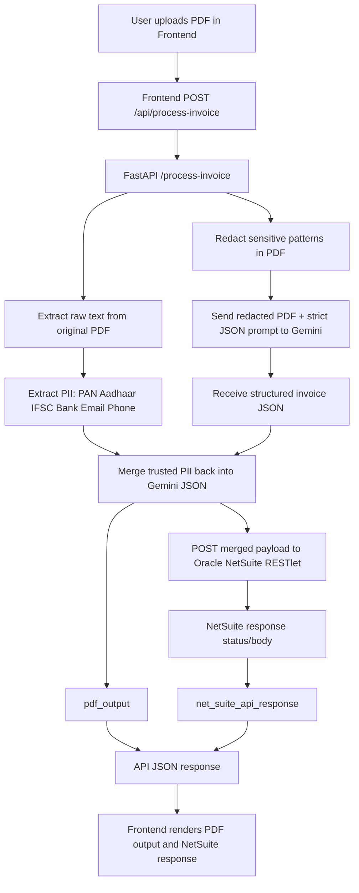

# Architecture Diagram

## System Components

- Frontend (React + Vite)
- Backend API (FastAPI)
- PII Layer (text extraction + PII detection + redaction)
- Gemini extraction service
- Oracle NetSuite RESTlet API

## Flow Diagram

## Responsibilities by Module

- backend/main.py: API orchestration for upload, processing, and response composition
- backend/pdf_utils.py: PDF text extraction and redaction operations
- backend/pii_extractor.py: Sensitive data extraction rules and heuristics
- backend/gemini_client.py: Gemini call and post-processing merge_pii
- backend/netsuite_client.py: OAuth1-authenticated NetSuite API update

## NetSuite Update Details

- Auth method: OAuth1 (HMAC-SHA256, Authorization header)
- Request: POST JSON payload to NETSUITE_URL
- Returned to client:
  - status_code
  - raw response body
